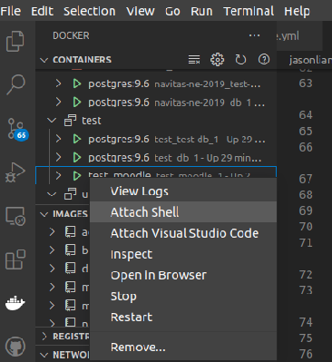

# Catalyst Moodle Environment Setup Script

Scripts to set up the local Moodle environment.

These scripts make minimum interaction possible during the Moodle environment setup process.
## Instructions

1. Clone the repo to your home directory

    ```
    cd ~/

    git clone https://github.com/jasonliancatalyst/catalyst-env-init.git

    cd ~/catalyst-env-init/
    ```

2. Run chmod to give .sh scripts permission

    ```
    sudo chmod +x *.sh
    ```

2. Create your project directory, and run the script inside it.

    ```
    cd ~/

    mkdir your_directory && cd your_directory

    ~/catalyst-env-init/moodle-env-init.sh

    ```

    Alternatively, you can use parameters so it'll minimise the input:

    ```
    ~/catalyst-env-init/moodle-env-init.sh [base_docker_environment_branch] [moodle_repo_url] [moodle_branch]
    ```

    Eg.

    ```
    ~/catalyst-env-init/moodle-env-init.sh 2004-psql https://github.com/moodle/moodle.git your_branch_name
    ```

3. It'll ask you to select the docker environment, currently it only supports psql environments:

    ```
    1) 1804-psql
    2) 2004-psql
    3) Quit
    Please input your base environment branch option and press enter [option number only]:
    ```

4. Input number `1`, `2` or `3` to pick from one of the options to proceed.

5. The next step it'll ask you the moodle project repo:

    `
    Please enter your site repo git URL:
    `

    This is your full git repo URL, eg.: `https://github.com/moodle/moodle.git`

6. The next step, enter your branch that you are going to use:

    `
    Please enter your site repo branch name:
    `

    Eg. `master`, `your_branch_name`.

    It can take a while, just wait for it to proceed.

7. It'll then ask you to proceed with the commands running inside the moodle container:

    `
    Do you wish to run init jobs (composer install/phpunit init) inside container? [Y/N]
    `

    Enter `Y` to proceed automatic setup, or otherwise enter `N`.

8. Wait for it to complete. It may ask you to enter your Ubuntu password to run `chmod`/`chown`.

   From this step, it should set up everything like the composer dependencies, phpunit, etc.

   Moodle will be set up with the following login details:

   user name: `admin`
   password: `soMePass123_`

9. The environment should be all set up.

    Now you can visit the local moodle site from http://localhost.

## Install vs code docker extension

Highly recommend that `Docker` extension is installed:

https://marketplace.visualstudio.com/items?itemName=ms-azuretools.vscode-docker

You can launch/stop containers, attach the interactive shell to the running containers from the vs code GUI side panel.


Attach an interactive shell session to a container:



## TODOs:

- [ ] Add interactive DB backup/import script
- [ ] Add more base docker environment supports Eg. MySQL
- [ ] Add additional docker network config so multiple environments can be set up and running at the same time. The http services should not come with port 80/443 conflict
- [ ] Add Nginx setup setups with Let's Encrypt to enable local https that can support multiple running web servers
